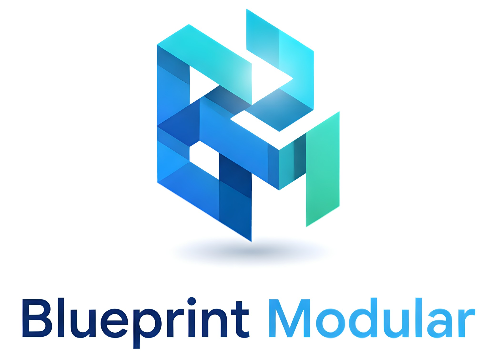

# Blueprint Modular

> Un instrument ne se contente pas d'afficher une valeur — il porte un jugement.



<!--
  TODO(showcase) : aucune capture du showcase n'existe au dépôt à ce jour.
  Quand une vraie capture de /components sera exportée (public/ ou docs/),
  remplacer l'image ci-dessus (ou décommenter la ligne ci-dessous). Ne pas
  inventer d'image.
  TODO(manifeste) : la phrase de catégorie ci-dessus reflète la primitive
  `interpret` (components/bpm/interpret.ts). Lui substituer la citation
  verbatim du Manifeste (repo `memory`, MANIFESTE_Blueprint.md) dès qu'une
  source publique est disponible.
-->
<!--  -->

Blueprint Modular n'est pas un énième UI kit. C'est une bibliothèque
d'**instruments** : 104 composants métier appelables comme des fonctions,
dont une classe porte la primitive de jugement partagée
`interpret(value, context)` — écart au repère, tendance, anomalie, sévérité.
La sémantique est unique, pure, et vérifiée par le convergence gate.

## Vivant

- **Vitrine** — <https://blueprint-modular.com>
- **App de démonstration** — <https://app.blueprint-modular.com>
- **Connecteur MCP** (lecture seule, sans auth) —
  `https://mcp.blueprint-modular.com/api/mcp` ·
  doc <https://blueprint-modular.com/mcp>

## Installer

**React / TypeScript** (npm)

```bash
npm install @blueprint-modular/core
```

```tsx
// Toujours en namespace — ne jamais destructurer.
import { bpm } from '@blueprint-modular/core'
import '@blueprint-modular/core/dist/style.css'
```

**Python** (PyPI)

```bash
pip install blueprint-modular
bpm run app.py
```

Intégration complète (CSS, Tailwind, SSR, API des composants) :
[`packages/core/USAGE.md`](packages/core/USAGE.md). Référence machine pour
agents : [`public/llms.txt`](public/llms.txt).

## Preuve — convergence gate

```bash
npm run gate
```

Une commande valide toute la surface : types (`tsc`), build (`vite`),
synchro doc, smoke render de chaque `bpm.*`, et snapshot des props
(toute suppression/renommage = échec — garantie θ-additive).

## Écosystème

[**Blueprint Maker**](https://blueprint-maker.com) — du prompt à l'app
Next.js, en composants `bpm.*`. Modular est le substrat ; Maker le fabrique.

## Aller plus loin

- Positionnement — <https://blueprint-modular.com/presentation>
- Catalogue MCP — [`docs/MCP_CONNECTOR.md`](docs/MCP_CONNECTOR.md)
- Référence machine — <https://blueprint-modular.com/llms.txt>

## Licence

`@blueprint-modular/core` : Apache-2.0 · `blueprint-modular` (PyPI) : MIT
</content>
</invoke>
