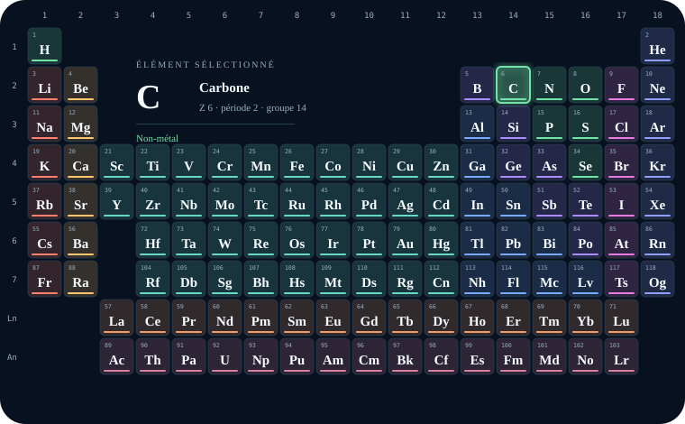
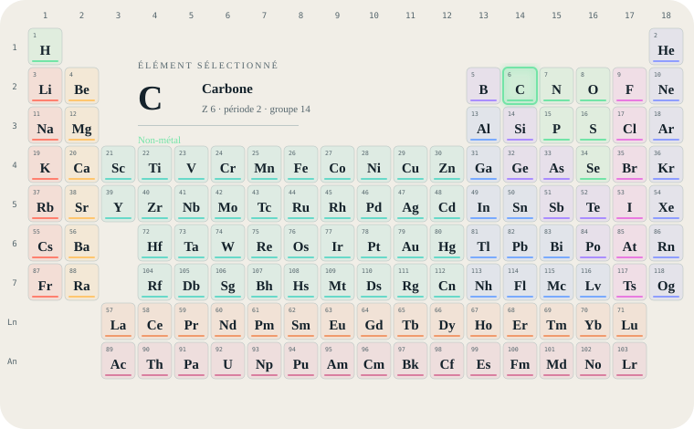
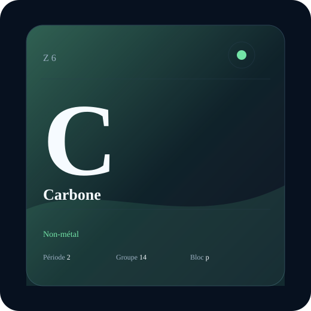
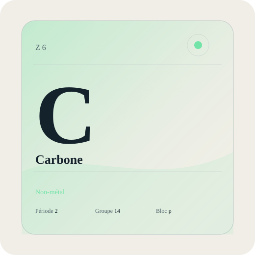
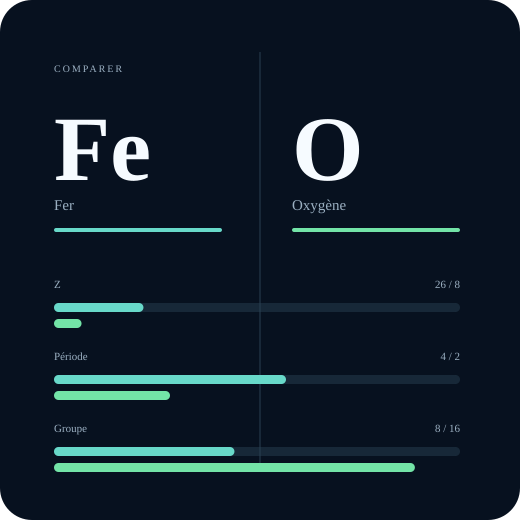
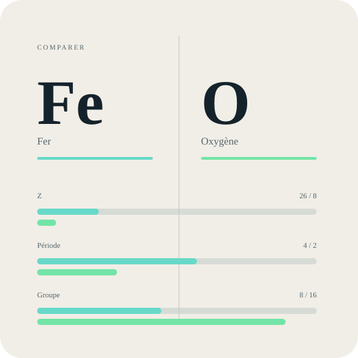

# Sciences & éléments — suivi qualité au 16 septembre 2026

Cette famille remplace la logique de séries décoratives par quatre vues
transverses d’un même modèle de données :

- science-periodic-table : les 118 éléments, sélection, groupes, périodes,
  blocs et familles ;
- science-atom : noyau et densité électronique schématiques ;
- science-element-card : fiche d’identité recomposable ;
- science-comparator : comparaison de deux éléments.

Chaque vue conserve cinq calques indépendants : structure, identité,
classification, repères et analyse. L’élément, le second élément et le mode de
couleur sont transportés dans .modular.json. Les styles midnight et paper ne
changent pas les données.

## Sources et limites

- IUPAC, Periodic Table of Elements, version du 4 mai 2022 :
  https://iupac.org/what-we-do/periodic-table-of-elements/
- NIST, Basic Atomic Spectroscopic Data — Periodic Table :
  https://physics.nist.gov/PhysRefData/Handbook/periodictable.htm

Les numéros atomiques, symboles et positions suivent ces références. La vue
atomique est une représentation pédagogique de densité, non un calcul
d’orbitales, non une géométrie d’électrons et non une vue à l’échelle.

## Mouvement caractéristique

La première version fusionnée faisait surtout tourner deux enveloppes : ce
mouvement ne satisfaisait pas la porte de qualité. La correction du 16 septembre
conserve les enveloppes comme repères fixes et anime quatre concentrations
locales de densité. Chaque lobe apparaît, se concentre, se dilate puis se
dissipe, avec des phases décalées sur une boucle de 12 s. Une pause fige la
phase, `prefers-reduced-motion` supprime le cycle et les vignettes restent fixes.

[Ouvrir la preuve SVG animée](science-atom-motion.svg). Cette preuve reprend les
mêmes quatre géométries, déphasages et keyframes que le composant ; elle ne vaut
pas validation du DOM React dans l’application consommatrice.

## Aperçus issus du composant

| Vue | Nuit | Papier |
|---|---|---|
| Tableau périodique |  |  |
| Analyseur atomique |  |  |
| Fiche d’élément |  |  |
| Comparateur |  |  |

## Preuves exécutées

Les huit SVG statiques ont été rendus depuis le composant réel puis inspectés
dans les deux styles. Leur poids transféré avec `gzip -9` va de 592 octets à
3,13 Kio. Aucun raster ni asset tiers n’est chargé.

La structure de l’animation, ses quatre phases locales, la pause, le bornage de
vitesse et `prefers-reduced-motion` sont couverts par tests. La preuve SVG a été
ouverte dans Chrome et inspectée à trois instants espacés de trois secondes :
les concentrations visibles changent bien de lobe et d’échelle sans rotation
globale. Cette vérification porte sur la preuve animée fidèle aux keyframes, pas
sur le composant React monté dans le catalogue. Le DOM applicatif, le rendu sur
téléphone physique, le coût GPU et la batterie restent donc non validés.
