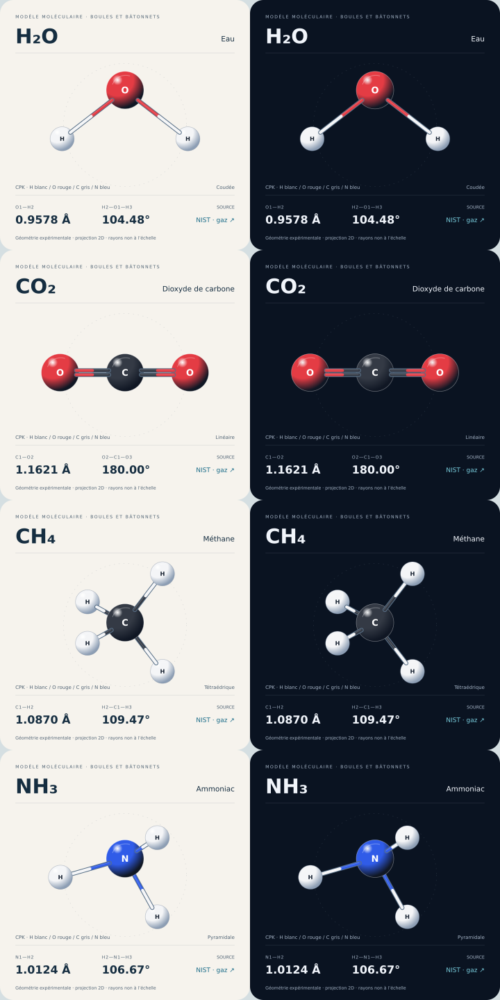

# Sciences & éléments — calques composables, 16 septembre 2026

Cette passe prolonge le socle fusionné #234 / Maker #2010.
Elle apporte un compositeur moléculaire, pas une simulation quantique.

- Carte atomique extraite en `AtomicDensityLayer`, boule indépendante
  `AtomSphereLayer`, graphe moléculaire `MoleculeLayer` : trois groupes SVG
  réutilisables sans carte ni arrière-plan.
- Eau, CO₂, CH₄ et NH₃, géométries gazeuses NIST ; couleurs CPK conventionnelles.
- Calques atomes/liaisons/symboles/mesures, coordonnées et ordres de liaison
  éditables. Toute édition du graphe devient une composition non validée.
- Nuit, Papier et Transparent ; le transparent hérite de la couleur de l’hôte.
- Tableau périodique, fiche et comparateur conservés. Les 118 identités ne changent pas.

## Consulter et essayer



[Calques transparents, fonds clair/sombre, 180 et 520 px](transparent-review.png).

Télécharger [la démonstration React autonome](layers.html) puis l’ouvrir :
aucun serveur ni chargement externe requis. Choisir un objet, un fond, une
molécule ; masquer les calques, orienter, ouvrir « Composer » et éditer les
atomes/liaisons. Le JSON affiché conserve tous les réglages. React/ReactDOM
sont inclus pour cette démo uniquement, avec leur licence MIT intégrée.

Les SVG `molecule-{water,carbon-dioxide,methane,ammonia}-{paper,midnight,transparent}.svg`
permettent aussi d’inspecter chaque vue séparément. Les posters distribués
incluent désormais `science-molecule` dans les trois styles.

## Rectification scientifique

La carte atomique est **qualitative et non calculée** : les anciennes
graduations de mesure, formes pseudo-orbitales déduites du seul bloc,
faux comptages de nucléons et pulsations ont été retirés.
Le nombre de neutrons n’est pas inventé sans isotope.
La densité d’une molécule ne se déduit pas en superposant ces dessins.

Les objets sont stationnaires, avec zéro boucle de rendu permanente.
Les sliders d’orientation sont une manipulation de présentation, pas une
dynamique moléculaire. Le fichier historique `science-atom-motion.svg` est
conservé pour les liens existants mais montre maintenant la vue stationnaire.
Il ne constitue plus une preuve animée.

[API, sources, unités et limites de composition](../../scientific-composition.md).

## Contrôles réalisés et non réalisés

- 489 tests Core réussis, dont les géométries NIST, les parseurs stricts,
  la rétrocompatibilité, les calques autonomes et un compositeur React monté
  dans JSDOM : choix du méthane, édition des coordonnées, retrait d’un calque,
  ajout d’un atome, perte du statut sourcé.
- Aperçus SVG réellement inspectés : quatre molécules en Papier/Nuit à 360 px,
  atome et eau transparents sur deux fonds en 180/520 px.
- Corrections issues de cette inspection : orientation initiale de NH₃ pour
  distinguer les trois H ; héritage de la couleur en mode transparent.
- Test des valeurs playing/speed : aucune animation n’est créée. Le modèle
  ne dépend pas de reduced-motion ou de la visibilité pour stopper une boucle,
  car il n’en crée pas.
- **Non exécuté** : validation visuelle et interactions dans un navigateur live
  local (`ERR_BLOCKED_BY_CLIENT`), téléphone physique, GPU, batterie et réseau
  mobile. Les tests JSDOM ne sont pas une preuve de rendu navigateur.
- Tests Maker : le transport et l’archive générée sont vérifiés séparément.
  Un scénario authentifié en production n’est pas revendiqué.
- Builds Core et site Next, 267 tests racine, documentation régénérée et
  import du véritable paquet construit : réussis. Les 14 tests moléculaires
  Maker ciblés passent ; lint des modules synchronisés et du nouvel adaptateur
  sans avertissement. Le script lint Modular existant (`next lint` sous Next 16)
  échoue avant de lire les fichiers ; il n’est pas compté comme réussi.

[Mesures brutes](layer-measurements.json) : 5,6–8,6 Ko par poster moléculaire
(1,6–1,9 Ko gzip), SVG de référence 520 × 520. La démo autonome inclut React
et les contrôles ; ce n’est pas le poids incrémental du package.
Le benchmark Sharp/libvips rasterise à 224 px sur CPU serveur Intel Xeon
Platinum 8573C, Linux x64, Node 24. Ce n’est ni le coût DOM/GPU ni une mesure
de transfert réseau ou de batterie.

## Reproduire

```sh
node --import tsx scripts/render-science-previews.tsx
node scripts/build-science-layer-demo.mjs
node scripts/render-science-evidence.mjs
npm --prefix packages/core run gate:types
npm --prefix packages/core run gate:test
npm --prefix packages/core run build
python scripts/generate-llms-txt.py
```

Les modifications restent soumises aux PR liées, sans fusion, publication npm
ni déploiement dans cette passe. Le contrôle visuel live reste une condition
avant de sortir du brouillon.
